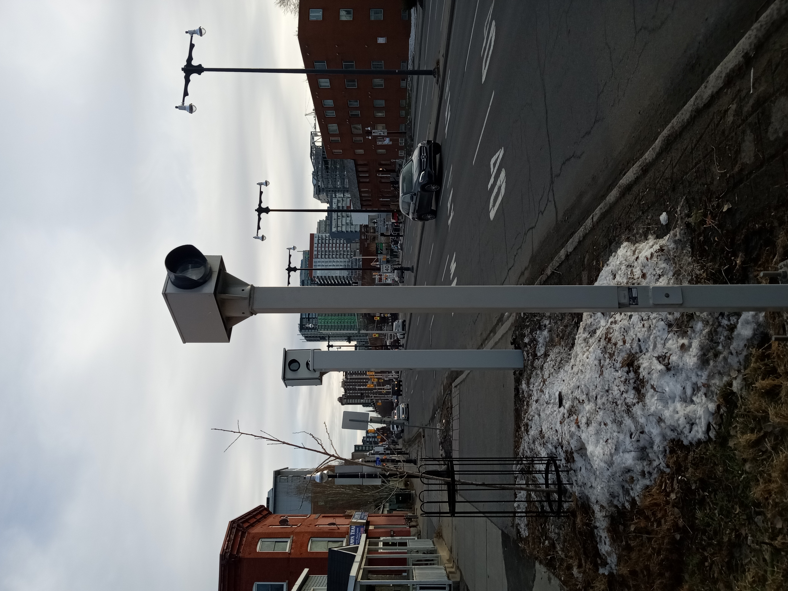
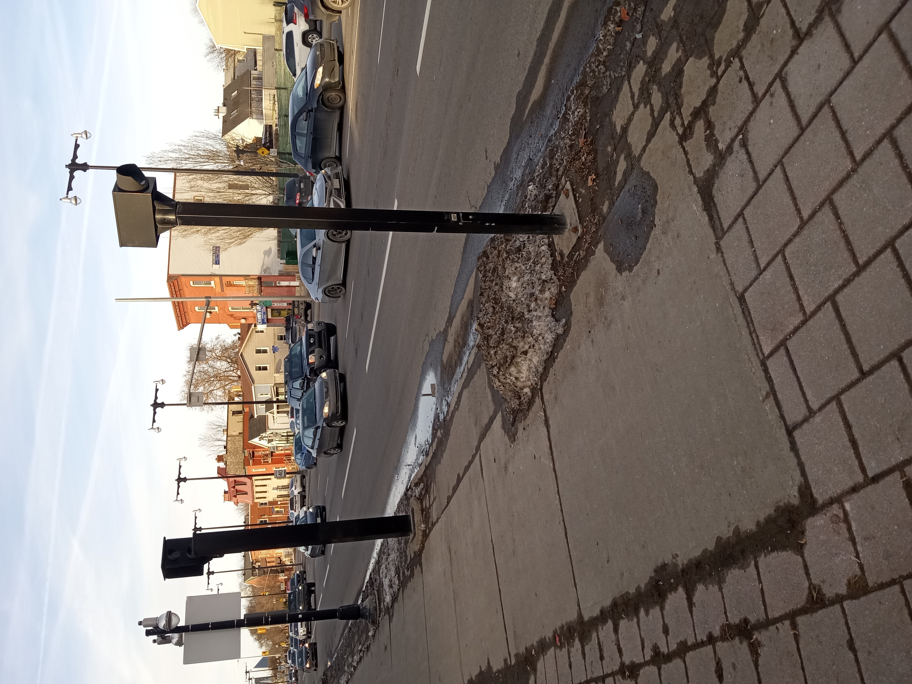
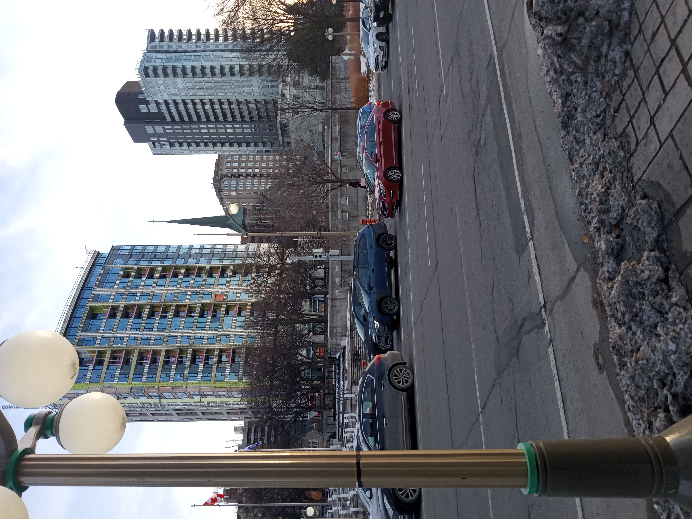
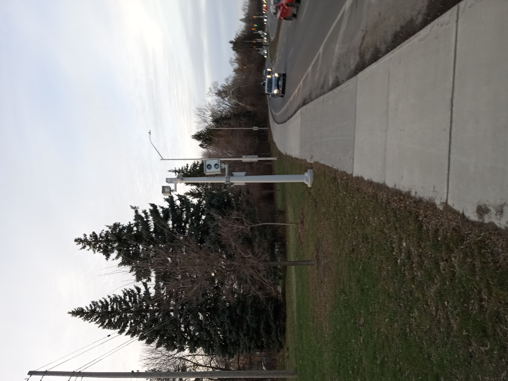
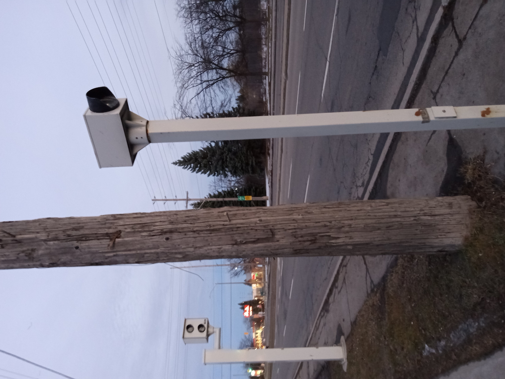

### Group 12 Data Storytelling Project

### MPAD 2003 Introductory Data Storytelling
### Due: December 22
### Student names: Angus Webb, Pascal Lewandowski, and Grayden Hunter.
### Title: Red-light instances.
### Words: 1,000-1,100

### Graphs

### Five Most-Violated Red Light Cameras
| Kind Edward / Saint Patrick | King Edward / Saint Andrew | Wellington / Bay | Vanier / Presland | Walkley / Ryder |
| ----------- | ----------- | ----------- | ----------- | ----------- |
|  |  |  |  |  |

### Main Project Point
How do red-light cameras in Ottawa differ with regard to their number of violations?

### Introduction and Background
The deployment of red-light cameras has become a standard practice in traffic management, serving a crucial role in reducing fatal injuries through enforced policies. While not fail-safe, these cameras have significantly reduced fatal road incidents and promote safer driving behaviors. By studying red-light camera data, we can perform a comparative analysis of various intersections, identifying areas that face greater challenges and may require more focused attention.

Our project is driven by the question of how do red-light cameras in Ottawa differ with regard to their number of violations? Not limited to understanding the distribution of traffic violations across the city but also to uncover underlying factors contributing to these violations. We have interviewed a variety of experts in traffic management, urban planning, and road safety, whose insights have provided us with a deeper understanding and concurrent methods. The experts we interviewed are Carleton University professor of transportation engineering in the department of Civil and Environmental Engineering, Yasser Hassan, Cathy Kourouma who works as a program manager of road safety traffic in the Safety & Mobility Public Works Department for the City of Ottawa as well as Ali Kassim, an adjunct research professor, contract instructor, and professor of Civil and Environmental Engineering at Carleton University.

Complementing these expert views, we analyzed data from the City of Ottawa, capturing a detailed picture of traffic flow and violation patterns across Ottawa's intersections. This data-driven story is further enriched by the creation of informative graphs, which visually represent the disparities and volume of red-light camera violations, offering a clearer perspective on the strategic placement and effectiveness of these cameras.

In our research, we will explore the implications of these findings. We aim to explore how socioeconomic factors, urban design, and traffic density contribute to the varying levels of violations. Additionally, we will examine the role of public awareness and driver behavior in the effectiveness of red-light cameras as a safety measure. This data-driven approach not only addresses our primary question but also provides a broader understanding of the role of red light cameras in urban traffic management and public safety. Throughout this paper we hope to contribute meaningful insights into the optimization of traffic control systems in Ottawa, potentially guiding policy decisions and enhancing road safety measures. 

### Data Analysis & Findings

The data visualizations that were produced came from OpenOttawa. The dataset we pulled from the database was titled “Red Light Camera Violations 2023.” It is a dataset containing all the red light camera violations from January to October 2023.
This dataset along with our interviews lead us to know the importance of Red Light Cameras and extent of the problem pertaining to collisions in the Ottawa region. There were three visualizations, two being stacked line graphs and one of them being a bar chart. While the stacked bar charts give a high volume of data, the bar chart is more accessible and less convoluted. All three of our visualizations were created with Datawrapper (https://www.datawrapper.de/). The maximum range of the red-light camera violations was key information to note, with 548 violations at King Edward @ St Patrick’s Street. Knowing that the maximum number of violations occurred here can help us realize problem areas. Having a dataset that shows the change in values throughout the year is key as well, to provide insight into problem times of the year. The maximum range occurred in July, showing that the summertime is the most dangerous time of the year. Correlating and comparing datasets is an integral part of selecting these spots to set up cameras, says Cathy Kourouma “Data such as collision data is used to select these spots”. 

To provide a safer and more efficient road system, Yasser Hassan made some recommendations. He provided useful insight on how the City of Ottawa’s cooperation with independent companies to build traffic lights hinders the production of the lights and the safety of users on the road. Proper construction and data analysis is key to making a more efficiently run traffic system.
By analyzing data, knowing where high volume collisions and red light violations occur is essential for Civil and Environmental Engineers like Mr. Hassan and for the city of Ottawa as well as its citizens as a whole. Data, AI and machine learning will only be utilized more and more in the future and integrated more into these systems as technology evolves.

### Conclusions & Implications
Our project could afford us many conclusions and implications. Our first conclusion is that red-light cameras are important. In the first graph, of how many accidents happen at the five most dangerous lights, we can see how many thousand cars and other vehicles violate red lights. This shows how vital red-light cameras are for deterring dangerous driving. Another conclusion is when these violations happen. The second graph shows more violations later in the year at the five most-dangerous cameras. This could imply that more drivers are on the road in the later months. Our third graph presents how many of these violations happen at specific intersections. It was interesting to learn that some of the biggest challenges for road safety is that their work is data-driven, so they must use large amounts of data to identify risks at the local level. 

Yasser Hassan is a professor in transportation engineering. Working for Transport Canada, he worked with a program for the City of Ottawa. The literature for red-light cameras does not seem consistent worldwide, however, they believe these cameras can prevent violations. Professor Hassan explains how in a theoretical city with 100 identical intersections, there would still be inconsistent results.

Cathy Kourouma is the program manager of road safety at Carleton. Our interview with her explored how all signalized intersections are reviewed on an annual basis, looking at collision history, frequency, and severity. She also examines what measurable benefit can be extracted. 

A recommendation I could make, judging by this data, is that more red-light cameras be installed around the city, and the five most important ones remain in position. Data analysis is an important tool for traffic management, as well as for urban planning. Findings from these cameras can be applied to reduce congestion on the road, or make the city safer to drive.

### Bibliography

[Cathy Kourouma & Ali Kassim Interview](https://ottawa.ca/en/city-hall/mayor-and-city-councillors/tim-tierney-councillor-ward-11-beacon-hill-cyrville) (We contacted Tim Tierney and he forwarded me to Cathy)

[Yasser Hassan Interview](https://carleton.ca/cee/profile/yasser-hassan/)

[Markdown guide: Markdown guide](markdownguide.org)

[Original OpenOttawa Dataset](https://open.ottawa.ca/datasets/ottawa::red-light-camera-violations-2023/explore)

[Google Sheets Document](https://docs.google.com/spreadsheets/d/1mApQ0AFGUMlbF4OrZMrWKW5Otq_Tb9qEg4cTug7qVeE/edit#gid=598565607)